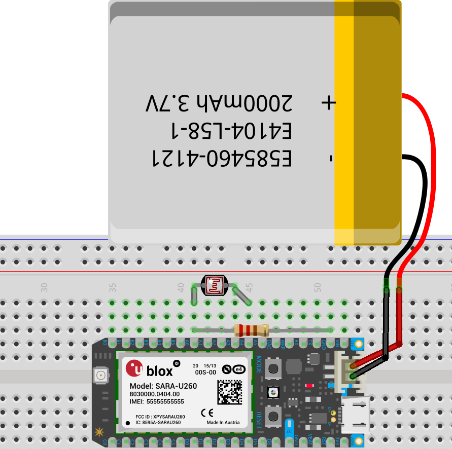
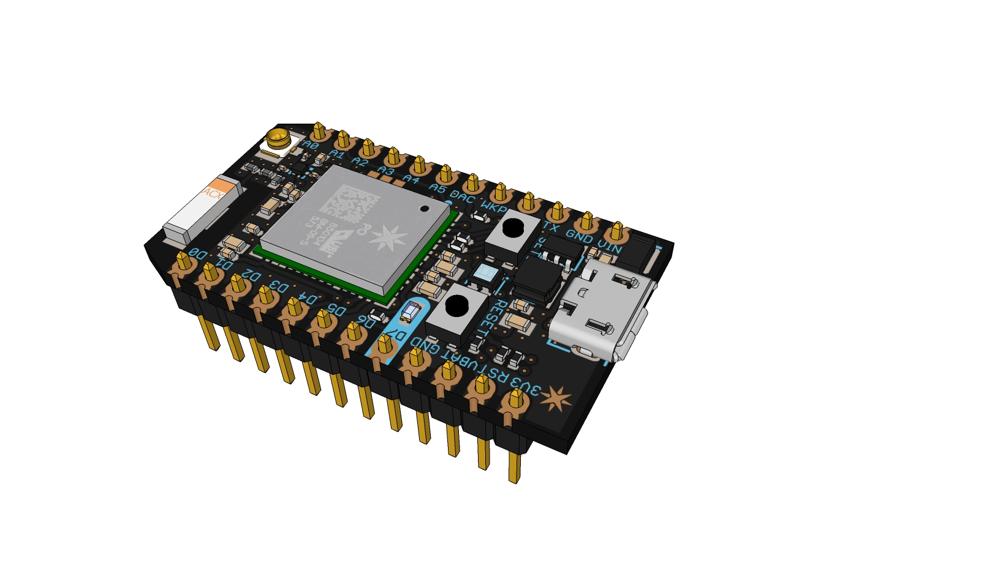
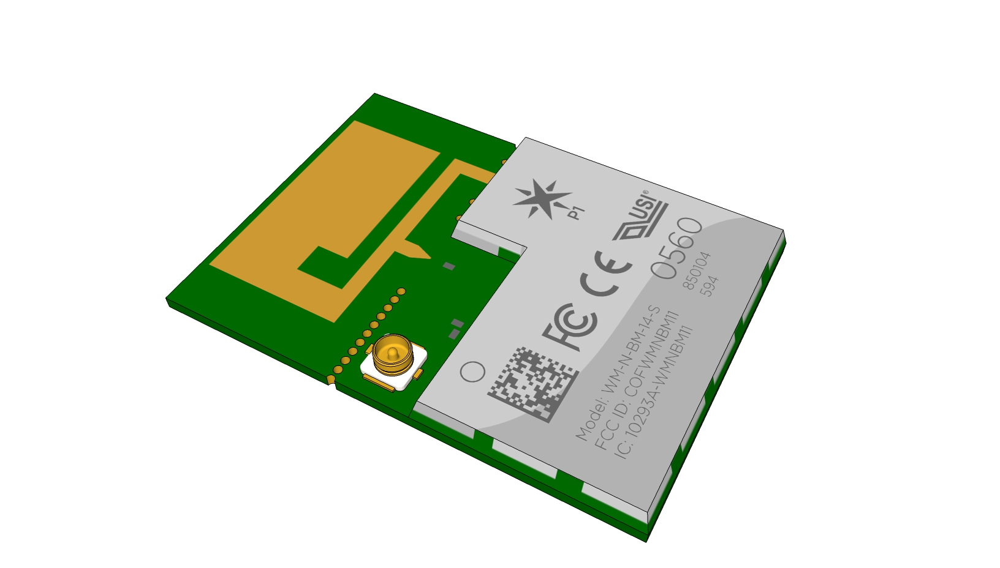
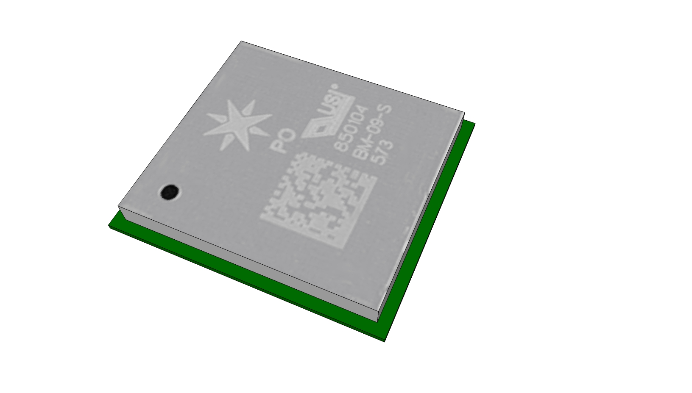
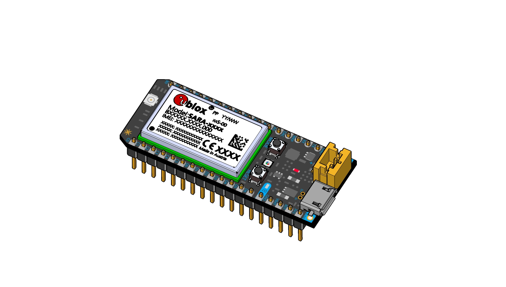
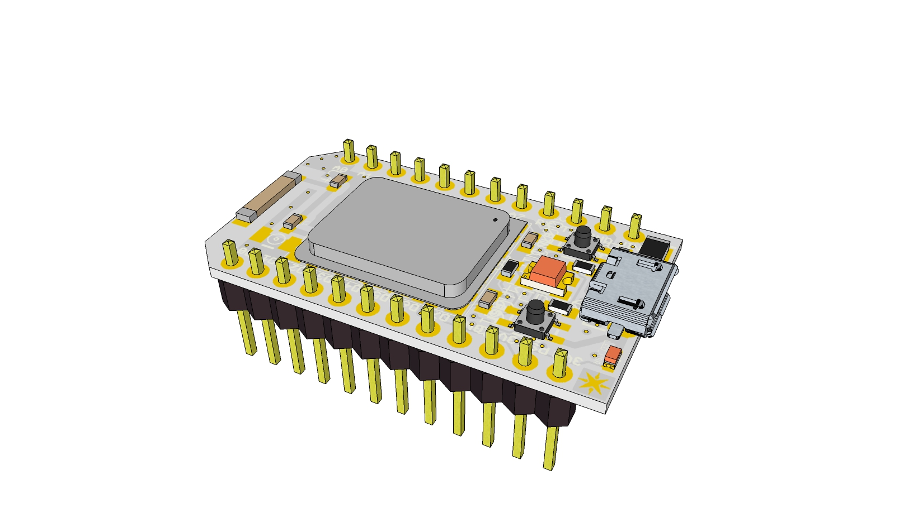

# Particle Devices Hardware Libraries

In this repository you'll find libraries of Particle devices for use in CAD software.

- [Parts to make breadboard diagrams in Fritzing](#hardware-prototyping)
- [Footprints to make circuit boards in Eagle](#pcb-footprints-land-pattern)
- [3D CAD models](#3d-cad-models)

**Show us what you make on the [community forum!][community]**

## Hardware Prototyping

[Fritzing](http://fritzing.org/home/) is a great open-source software to document your hardware projects. Here's how to add Particle devices to your projects:

1. [Download the Fritzing library][fritzing-library]
2. In Fritzing, use File -> Open to import the library.
3. Create a new sketch and add parts from the Particle bin.

[][fritzing-library]

## PCB Footprints (land pattern)

PCB footprints or land patterns for Eagle are provided as a reference and you may need to adjust them for your application.

[Download the Eagle library][eagle-library], unzip it and place it in your Eagle libraries folder.

If you would like to contribute a library with the PCB footprints for another software, like KiCad, please [submit a pull request.][pr]

See the documentation for more details on the recommended PCB foot prints.

* [Electron][pcb-footprint-electron]
* [Photon with headers][pcb-footprint-photon]
* [Photon surface mount][pcb-footprint-photon-smd]

### How to Use Eagle

If you need more information about how to use Eagle, check out the Sparkfun Eagle Tutorials: 

* [Installing an Eagle Library](https://learn.sparkfun.com/tutorials/how-to-install-and-setup-eagle#using-the-sparkfun-libraries)
* [Installing Eagle](https://learn.sparkfun.com/tutorials/how-to-install-and-setup-eagle)
* [Creating Schematics](https://learn.sparkfun.com/tutorials/using-eagle-schematic)
* [Creating Boards](https://learn.sparkfun.com/tutorials/using-eagle-board-layout)
* [Designing Custom Footprints](https://learn.sparkfun.com/tutorials/designing-pcbs-smd-footprints)
* [Creating Footprints from Digital Imagery](https://learn.sparkfun.com/tutorials/making-custom-footprints-in-eagle)

## 3D CAD Models

Here are some 3D models, most of which are provided by our awesome community! Please review them before using them to create your own enclosures or products.

If you want to improve any model or convert them to another CAD format, please [submit a pull request][pr]

### Models in Solidworks format

- [Electron][solidworks-electron] by Particle

- [Photon][solidworks-photon] by Particle

### Models in Sketchup format

- [Photon (headers and without headers)][sketchup-photon] by Daniel Sullivan [@mumblepins][mumblepins]

[][sketchup-photon]
[][sketchup-photon]

- [P1][sketchup-p1] by Daniel Sullivan [@mumblepins][mumblepins]

[][sketchup-p1]

- [P0][sketchup-p0] by Daniel Sullivan [@mumblepins][mumblepins]

[][sketchup-p0]

- [Electron][sketchup-electron] by Alan Mond [@alan707][alan707]

[][sketchup-electron]

- [Core][sketchup-core] by Ryotsuke

[][sketchup-core]

## License Information

Designed by Particle unless otherwise noted.

All files distributed under a Creative Commons Attribution, Share-Alike license.

[community]: https://community.particle.io
[pr]: https://github.com/particle-iot/hardware-libraries/pulls

[fritzing-library]: https://github.com/particle-iot/hardware-libraries/raw/master/Fritzing/Particle.fzbz

[eagle-library]: https://github.com/particle-iot/hardware-libraries/blob/master/Eagle/Particle-Devices.zip

[pcb-footprint-electron]: https://docs.particle.io/datasheets/electron-datasheet/#recommended-pcb-land-pattern
[pcb-footprint-photon]: https://docs.particle.io/datasheets/photon-datasheet/#recommended-pcb-land-pattern-photon-with-headers-
[pcb-footprint-photon-smd]: https://docs.particle.io/datasheets/photon-datasheet/#recommended-pcb-land-pattern-photon-without-headers-

[solidworks-electron]: https://github.com/particle-iot/hardware-libraries/raw/master/CAD/Electron%20-%20Solidworks.zip
[solidworks-photon]: https://github.com/particle-iot/hardware-libraries/raw/master/CAD/Photon%20-%20Solidworks.SLDPRT

[sketchup-photon]: https://github.com/particle-iot/hardware-libraries/raw/master/CAD/Photon.skp.zip
[sketchup-p1]: https://github.com/particle-iot/hardware-libraries/raw/master/CAD/P1.skp.zip
[sketchup-p0]: https://github.com/particle-iot/hardware-libraries/raw/master/CAD/P0.skp.zip
[sketchup-electron]: https://github.com/particle-iot/hardware-libraries/raw/master/CAD/Electron.skp.zip
[sketchup-core]: https://github.com/particle-iot/hardware-libraries/raw/master/CAD/Core.skp.zip

[mumblepins]: https://github.com/mumblepins
[alan707]: https://github.com/alan707
