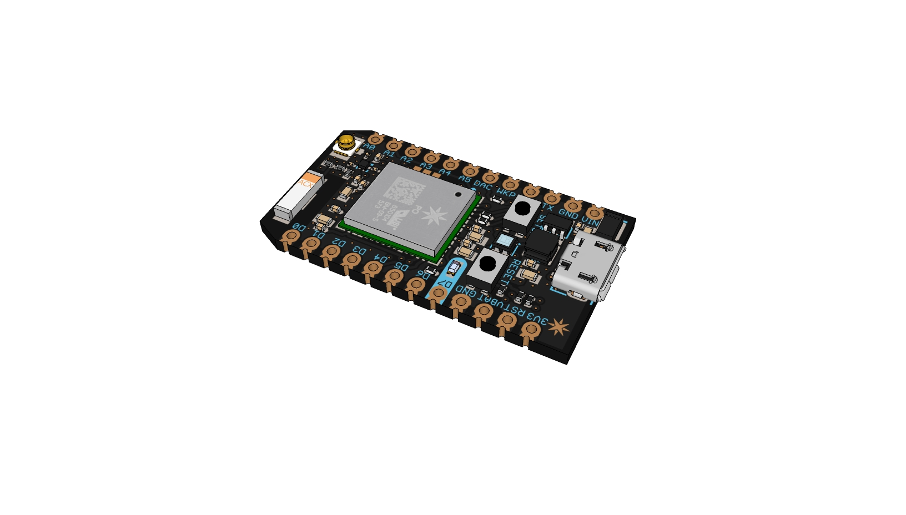

# Particle Devices Eagle Library

In this library you'll find representation of Particle devices for use in CAD software.

- [Parts to make breadboard diagrams in Fritzing](https://github.com/spark/hardware-libraries/tree/master/Fritzing)
- [Footprints to make circuit boards in Eagle](https://github.com/spark/hardware-libraries/tree/master/Eagle)
- [3D models in Sketchup](https://github.com/spark/hardware-libraries/tree/master/CAD)

**Show us what you make on the [community forum!](https://community.particle.io)**

## Hardware Prototyping

[Fritzing](http://fritzing.org/home/) is a great open-source software to document your hardware projects. Here's how to add Particle devices to your projects:

1. [Download the Fritzing library](https://rawgit.com/spark/hardware-libraries/master/Fritzing/Particle.fzpz)
2. In Fritzing, use File -> Open to import the library.
3. Create a new sketch and add parts from the Particle bin.

## PCB Footprints

PCB footprints for Eagle are provided as a reference and you may need to adjust them for your application.

If you would like to contribute a library with the PCB footprints for another software, like KiCad, please [submit a pull request](https://github.com/spark/hardware-libraries/pulls)

See the documentation for more details on the recommended PCB foot prints.

* [Electron](https://docs.particle.io/datasheets/electron-datasheet/#recommended-pcb-land-pattern)
* [Photon with headers](https://docs.particle.io/datasheets/photon-datasheet/#recommended-pcb-land-pattern-photon-with-headers-)
* [Photon without headers](https://docs.particle.io/datasheets/photon-datasheet/#recommended-pcb-land-pattern-photon-without-headers-)

### How to Use Eagle

If you need more information about how to use Eagle, check out the Sparkfun Eagle Tutorials: 

* [Installing an Eagle Library](https://learn.sparkfun.com/tutorials/how-to-install-and-setup-eagle#using-the-sparkfun-libraries)
* [Installing Eagle](https://learn.sparkfun.com/tutorials/how-to-install-and-setup-eagle)
* [Creating Schematics](https://learn.sparkfun.com/tutorials/using-eagle-schematic)
* [Creating Boards](https://learn.sparkfun.com/tutorials/using-eagle-board-layout)
* [Designing Custom Footprints](https://learn.sparkfun.com/tutorials/designing-pcbs-smd-footprints)
* [Creating Footprints from Digital Imagery](https://learn.sparkfun.com/tutorials/making-custom-footprints-in-eagle)

## 3D CAD Models

Here are some 3D models provided by our awesome community! Please review them before using them to create your own enclosures or products.

Currently all models are provided in Sketchup format. If you want to improve any model or convert it to another format, please [submit a pull request](https://github.com/spark/hardware-libraries/pulls)

- [Photon (headers and without headers)](https://rawgit.com/spark/hardware-libraries/master/CAD/Photon.skp) by Daniel Sullivan @mumblepins

- [P1](https://rawgit.com/spark/hardware-libraries/master/CAD/P1.skp) by Daniel Sullivan @mumblepins

- [P0](https://rawgit.com/spark/hardware-libraries/master/CAD/P0.skp) by Daniel Sullivan @mumblepins

- [Electron](https://rawgit.com/spark/hardware-libraries/master/CAD/Electron.skp) by Alan Mond @alan707

- [Core](https://rawgit.com/spark/hardware-libraries/master/CAD/Core.skp) by Ryotsuke

## License Information

Designed by Particle unless otherwise noted.

All files distributed under a Creative Commons Attribution, Share-Alike license.
